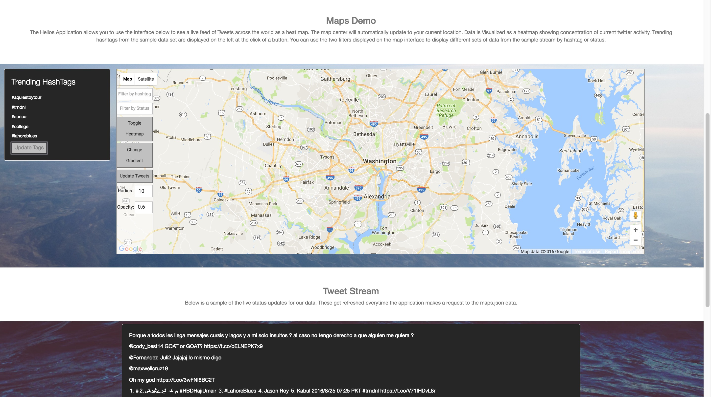

# README Helios

Helios is a single page application that displays a heat-map layer over a traditional google map. With the use of custom directives, angular filters, and directives provided by the angular google maps team, users are able to interact with different menu filters to display a new heatmap based on hashtag or status content.

The app uses a simple eventmachine/twitterstream gem combination to
provide our postgresql database with a stream of incoming tweet status, geo coordinates, and bounding boxes. We created a rails backend in order to serve this data as a json request that our mounted angular framework could pull from and manipulate.

The entire stack consists of postgresql for the database, Ruby on Rails for the back end custom api structure, and Angular mounted and integrated with rails for the front-end.

## Technologies Used

The main rake file engine behind the app that grabs the data is based on the two gems that are [available](rubygems.org) at rubygems.org. Their github repositories are listed below. The different Angular resources and postgresql documentation can also be found below:
* [Angular](https://angularjs.org/) ~ Angular 1.5.8
* [Angular google maps](http://angular-ui.github.io/angular-google-maps/#!/) Angular Maps
* [Ruby on Rails](https://github.com/rails/rails) ~ Rails 5.0.
* [TweetStream](https://github.com/tweetstream/tweetstream): Connect and receive live tweets  ~ 2.6.0
* [Event Machine](https://github.com/eventmachine/eventmachine): set up tasks in combined gems ~ v1.2.0.1
* [postgresql](https://www.postgresql.org/)
* [Heroku](http://www.heroku.com/): hosting this bad boy

##App approach and planning
The app was developed and is currently being maintained and built on by [John Estes](https://github.com/johnestes4), [Michael Mahony](https://github.com/michaelmahony), and [Christopher Phillips](https://github.com/chris-A-phillips)

Timeline for product 5 days.

Before writing any code we made sure to whiteboard out the general data flow of our application. We wanted to hammer down the stack we were using to manage this path before starting.

One of the bigger organizational features was a Trello Board where we were able to separate out features, branches, issues, and updates into lanes that were titled backlog, In Progress, Tracking, and Complete. We were able to reduce the majority of merge conflicts this way by staying in the specific feature files we had checked out.

From there we divided up with one of us taking the Front-End Doc dive for angular maps ([John Estes MVP](https://github.com/johnestes4)). [Mike](https://github.com/michaelmahony) and [Chris](https://github.com/chris-A-phillips) dividing up build tasks for data scraping, api design, and the rails boilerplate for mounting.

We used the weekend to mount John's front end efforts onto our Rails Api and then started working on styling and filter features for the main single page app. An depth discussion of each technology section can be found below.
##Back-End-Technology
The Helios backend is written in Ruby on Rails and is implemented as a JSON API.

We query Twitter's Tweetstream API, sanitize the results as they come through in real time, and format each tweet for storage in Postgres.

Tweets come in with a disparate amount of location data: some are fully populated with coordinates, but the majority have a Place object that defines, among other things, a bounding box that the tweet originated within.

We take the coordinates that define the boundaries of this box and use them to approximate a single point of origin for each tweet.

The Tweet's text, hashtags, and coordinate pair are then saved to our database to be served in response to API calls.

##Front-end-Technology
The map runs off a custom set of Angular directives used to port Google's Javascript API into Angular. Coordinates then are pulled from the twitter stream and loaded into an array. This array is then plugged into the Maps API in order to generate a base layer of heatmapping.

The filtering occurs by loading that array with a filtered set of coordinates and redrawing the heatmap with every character the user enters into the text fields.

The map also utilizes HTML5's location services to center the map around the user's current coordinates.

###Unsolved Problems
